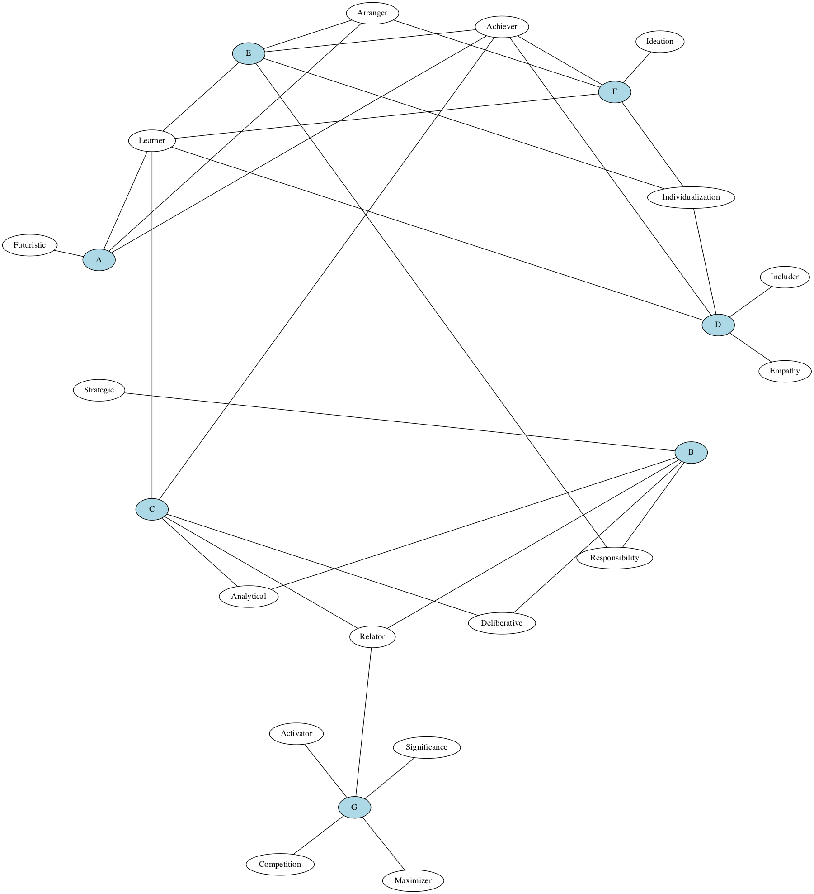

strengths-finders
---

## Instructions
- input document
  - matrix of team members (rows) by their strengths (columns)
  - allow first row to be strengths domains
- save it as a csv
- change the FILEPATH constant in the script
- run the script
